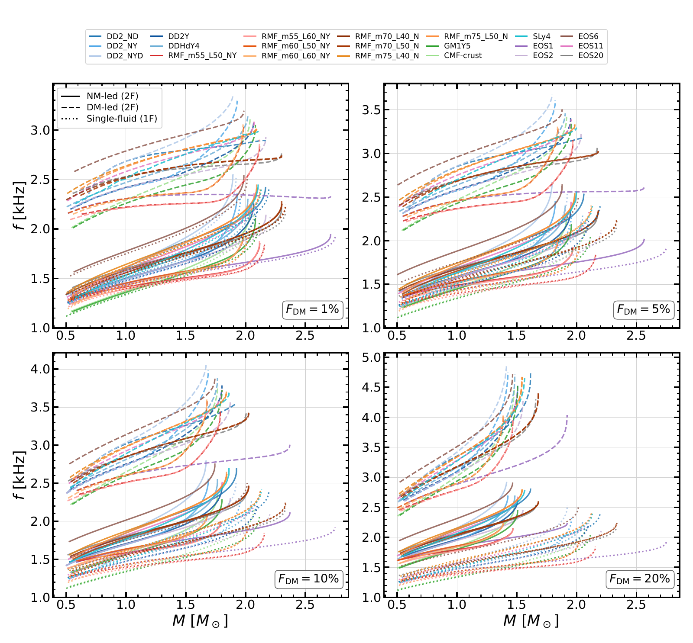

# Two-fluid neutron-star f-mode data

Numerical data and data-only reproduction scripts accompanying
**Dark matter in neutron stars: two-fluid f-mode oscillations in full general relativity**,
by Prashant Thakur, Ishfaq Ahmad Rather, and Y. Lim.

**Data-only reproduction repository. The stellar solver source is excluded.**

Full-GR mode frequencies and gravitational-wave damping times for bosonic
dark-matter-admixed neutron stars: **21 nuclear equations of state, core and
halo configurations, and four dark-matter fractions**. Reproduce **12 figures
and 3 tables from the saved numerical data with one command**.



*Core configurations: solid curves are NM-led modes, dashed curves are
DM-led modes, and dotted curves are pure normal-matter references. Panels
show dark-matter fractions of 1%, 5%, 10%, and 20%.*
[View the full-resolution figure](reference/paper_figures/core_freq.pdf).

## Reproduce everything

On Linux with Python 3.11 or 3.12, unzip this repository, open a terminal in
its top-level directory, and run:

```bash
bash reproduce.sh
```

This creates a local `.venv`, installs the exact dependencies in
`requirements.lock`, checks the input hashes, and regenerates **12 figures
and 3 tables**. The first run needs internet access to download Python
packages. No account, access token, LaTeX installation, GPU, cluster, or
stellar solver is required.

Results are written only to `output/`:

- `figures/`: twelve vector PDF figures, named as in the paper.
- `tables/`: three LaTeX row files and machine-readable JSON tables.
- `tables/tidal_diagnostics.json`: the recomputed binary criteria and diagnostics.
- `verification.json`: numerical checks, software versions, and output hashes.

The last line must begin `PASS`. For subsequent offline runs, use
`.venv/bin/python -m reproduction`. To check an existing result without
rendering again, use `.venv/bin/python -m reproduction --verify-only`.

## What this reproduces

This repository reproduces figures and table summaries **from the saved
full-GR numerical results**. It does not recompute stellar equilibria or
quasinormal-mode roots. The stellar solver and its source code are not part
of this repository.

The source code for the full-GR two-fluid solver may be made available by
the corresponding author upon reasonable request.

The inputs cover 21 normal-matter equations of state, dark fractions of
1%, 5%, 10%, and 20%, core and halo sequences, representative eigenfunctions,
the self-coupling scan, and the published octupolar frequencies. The halo
damping catalogue contains 157 certified halo modes and 11 explicitly marked
nonhalo endpoints. The tidal criteria use the paper's separate 13-EOS halo
subset; that subset is not silently enlarged.

The saved numerical curves are authoritative. Some figure layouts have been
reconstructed because the final rendering recipes were not archived. Those
outputs reproduce the numerical content, not byte-identical typography or
page layout. Original paper PDFs are included separately in
`reference/paper_figures/` for comparison; the renderers never read them.
Observational shading is provided as archived display-contour coordinates,
**not raw posterior samples or a new statistical analysis**.

## Documentation

- [Manual](docs/MANUAL.md): installation, commands, outputs, troubleshooting.
- [Data dictionary](docs/DATA_DICTIONARY.md): file structure, units, flags.
- [Provenance and conventions](docs/PROVENANCE.md): caps, missing points,
  rounding, interpolation, and reproducibility limits.
- [Verification record](docs/VERIFICATION.md): clean-install test results.
- [Release record](docs/RELEASE_CHECKLIST.md): publication scope and remaining licensing decisions.
- [Citation information](CITATION.cff).

## Development checks

```bash
.venv/bin/python -m unittest discover -s tests -v
```

All analysis dependencies are pinned. The optional GitHub workflow tests
Python 3.11 and 3.12 with read-only repository permissions. It performs no
publication or deployment.

## Citation and permissions

Cite the associated article and this dataset when using these data. An
article identifier and a permanent dataset identifier will be added only
after they exist. See `CITATION.cff` and `LICENSE-NOTICE.md`.

The project owner authorized public access to this data/reproduction repository
on 2026-10-04. No additional software or data reuse license has been selected;
see the rights notice. The separate stellar solver remains private.
